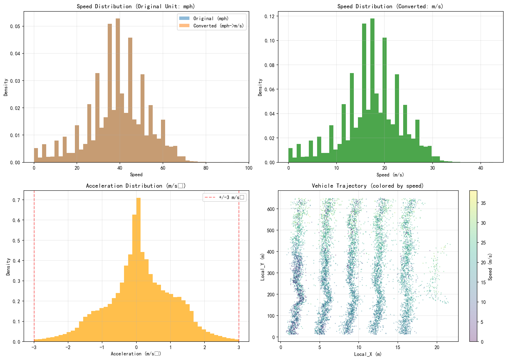

# 原始数据清洗与坐标转换分析报告

## 1. 概述

本报告描述了NGSIM-US-101数据集的坐标转换和单位换算过程，以及异常值清洗的处理结果。

## 2. 转换方法

### 2.1 单位换算

| 物理量 | 原始单位 | 目标单位 | 转换公式 |
|--------|----------|----------|----------|
| 长度 | 英尺 (feet) | 米 (m) | 1 ft = 0.3048 m |
| 速度 | 英里/小时 (mph) | 米/秒 (m/s) | 1 mph = 0.44704 m/s |
| 加速度 | ft/s² | m/s² | 1 ft/s² = 0.3048 m/s² |

### 2.2 异常值清洗规则

| 条件 | 阈值 |
|------|------|
| 速度范围 | 0 - 50 m/s |
| 加速度范围 | ±3 m/s² |

## 3. 数据统计

### 3.1 数据量

| 指标 | 数值 |
|------|------|
| 原始记录数 | 1,048,575 |
| 清洗后记录数 | 1,025,173 |
| 清洗比例 | 2.23% |
| 总车辆数 | 1,993 |

### 3.2 速度统计 (转换后: m/s)

| 指标 | 数值 |
|------|------|
| 平均值 | 17.41 |
| 标准差 | 6.24 |
| 最小值 | 0.00 |
| 最大值 | 42.60 |

### 3.3 加速度统计 (转换后: m/s²)

| 指标 | 数值 |
|------|------|
| 平均值 | 0.1101 |
| 标准差 | 0.99 |

## 4. 可视化结果

## 5. 结论

1. 成功完成了所有单位的国际单位制转换
2. 异常值清洗剔除了约 2.23% 的数据
3. 转换后的数据符合物理规律

## 6. 输出文件

- 清洗转换后数据: `code/output/trajectories_cleaned.csv`
- 可视化图像: `doc/pic/coordinate_conversion.png`
- 分析报告: `doc/coordinate_conversion_report.md`
