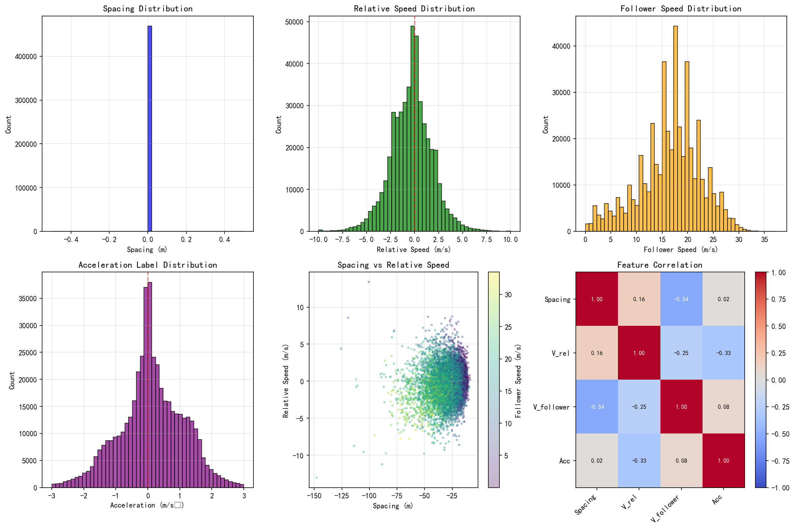

# 特征变量计算分析报告

## 1. 概述

本报告描述了跟驰场景下特征变量的计算过程和统计结果。

## 2. 特征定义

| 特征 | 公式 | 说明 |
|------|------|------|
| 后车速度 (v_f) | 直接提取 | 平滑后的后车速度 (m/s) |
| 相对距离 (s) | s = y_leader - y_follower - L_leader | 前后车车身间距 (m) |
| 相对速度 (v_rel) | v_rel = v_leader - v_follower | 前车速度 - 后车速度 (m/s) |
| 标签 | 后车加速度 | 用于模型预测的目标变量 (m/s²) |

## 3. 数据统计

### 3.1 数据量

| 指标 | 数值 |
|------|------|
| 原始记录数 | 630,453 |
| 特征计算后记录数 | 468,779 |
| 跟驰对数量 | 467,757 |

### 3.2 相对距离统计 (m)

| 指标 | 数值 |
|------|------|
| 平均值 | -28.56 |
| 标准差 | 11.89 |
| 最小值 | -191.99 |
| 最大值 | -7.32 |

### 3.3 相对速度统计 (m/s)

| 指标 | 数值 |
|------|------|
| 平均值 | -0.34 |
| 标准差 | 2.14 |
| 最小值 | -16.01 |
| 最大值 | 14.70 |

### 3.4 后车速度统计 (m/s)

| 指标 | 数值 |
|------|------|
| 平均值 | 16.68 |
| 标准差 | 5.95 |
| 最小值 | 0.00 |
| 最大值 | 37.51 |

### 3.5 加速度标签统计 (m/s²)

| 指标 | 数值 |
|------|------|
| 平均值 | 0.1139 |
| 标准差 | 0.99 |
| 最小值 | -3.00 |
| 最大值 | 3.00 |

## 4. 可视化结果

## 5. 结论

1. 成功计算了4个核心特征变量
2. 相对距离和相对速度分布符合跟驰场景的物理规律
3. 加速度标签分布近似正态分布，均值接近0

## 6. 输出文件

- 特征数据: `code/output/features.csv`
- 可视化图像: `doc/pic/feature_distribution.png`
- 分析报告: `doc/feature_report.md`
