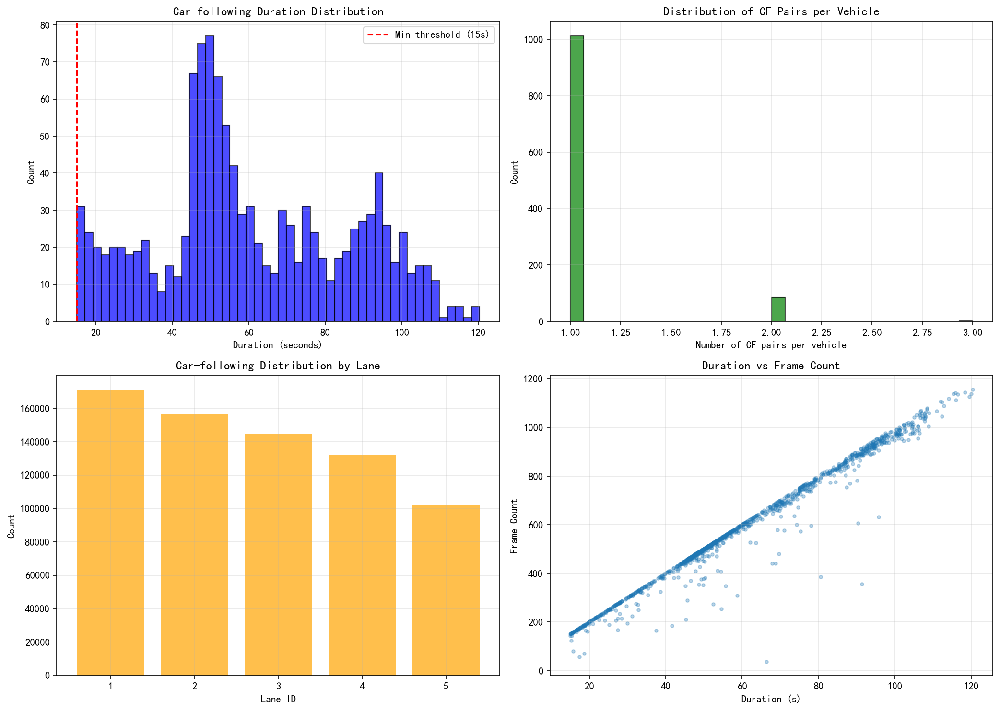

# 跟驰对提取分析报告

## 1. 概述

本报告描述了NGSIM-US-101数据集中跟驰对(Car-following Pairs)的提取过程和方法。

## 2. 提取方法

### 2.1 匹配规则

1. **唯一ID匹配**：根据 `Vehicle_ID` 和 `Preceeding` 提取前后车配对关系
2. **时空连续性检查**：
   - 前后车必须位于同一车道
   - 共存时间需超过 15 秒
3. **异常剔除**：
   - 过滤掉存在换道行为的车辆

### 2.2 参数设置

| 参数 | 值 |
|------|------|
| 最小共存时间 | 15 秒 |
| 同车道要求 | True |

## 3. 数据统计

### 3.1 提取结果

| 指标 | 数值 |
|------|------|
| 原始记录数 | 1,031,141 |
| 跟驰记录数 | 706,903 |
| 跟驰对数量 | 1,198 |
| 提取比例 | 68.56% |

### 3.2 持续时间统计

| 指标 | 数值 |
|------|------|
| 平均持续时间 | 60.63 秒 |
| 最大持续时间 | 120.40 秒 |
| 最小持续时间 | 15.00 秒 |

### 3.3 车道分布

| 车道 | 记录数 |
|------|--------|
| 1 | 171,051 |
| 2 | 156,554 |
| 3 | 144,820 |
| 4 | 132,012 |
| 5 | 102,466 |

## 4. 可视化结果

## 5. 结论

1. 成功提取了 1,198 对跟驰关系
2. 平均跟驰持续时间为 60.63 秒
3. 数据已准备好用于后续特征计算

## 6. 输出文件

- 跟驰对数据: `code/output/car_following_pairs.csv`
- 可视化图像: `doc/pic/car_following_pairs.png`
- 分析报告: `doc/car_following_report.md`
